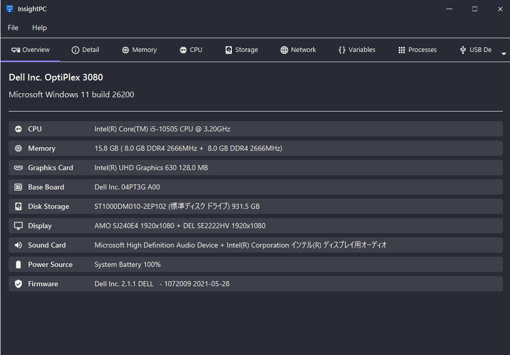
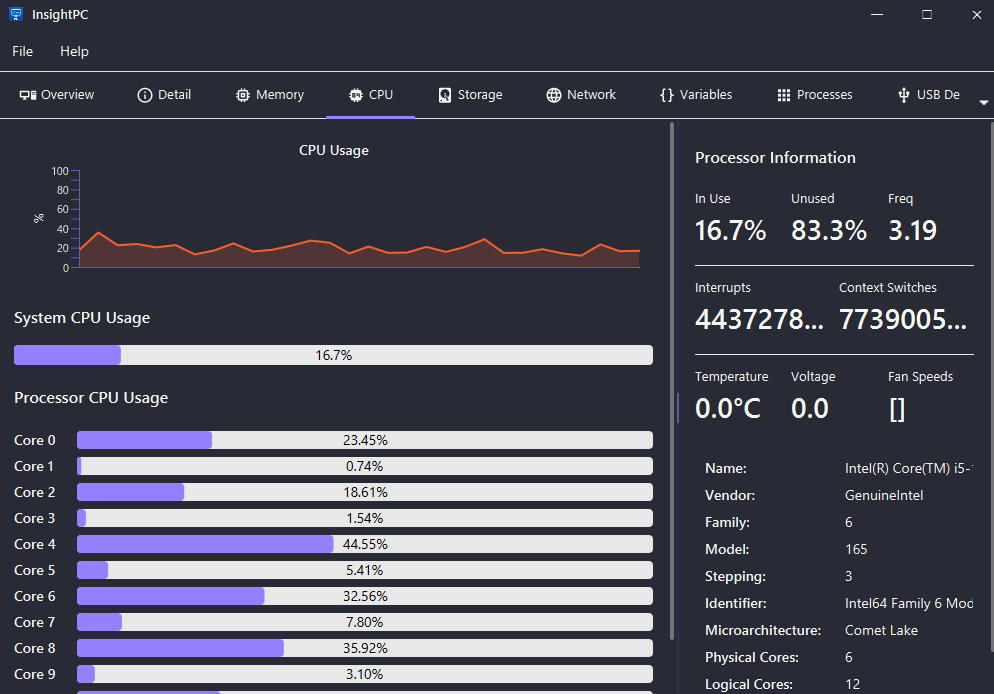
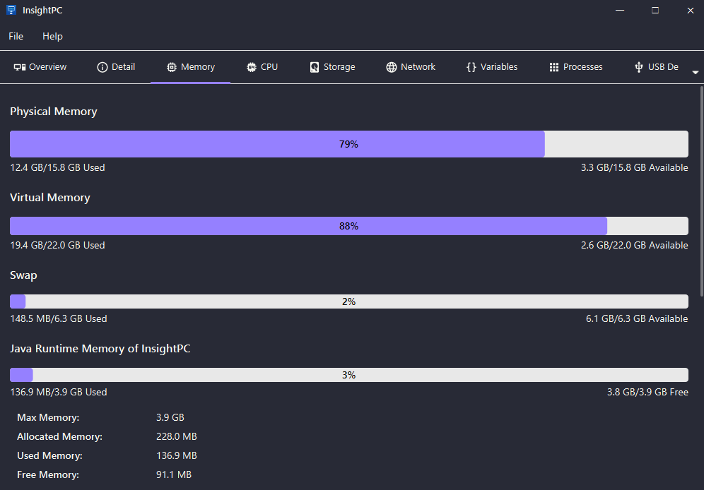
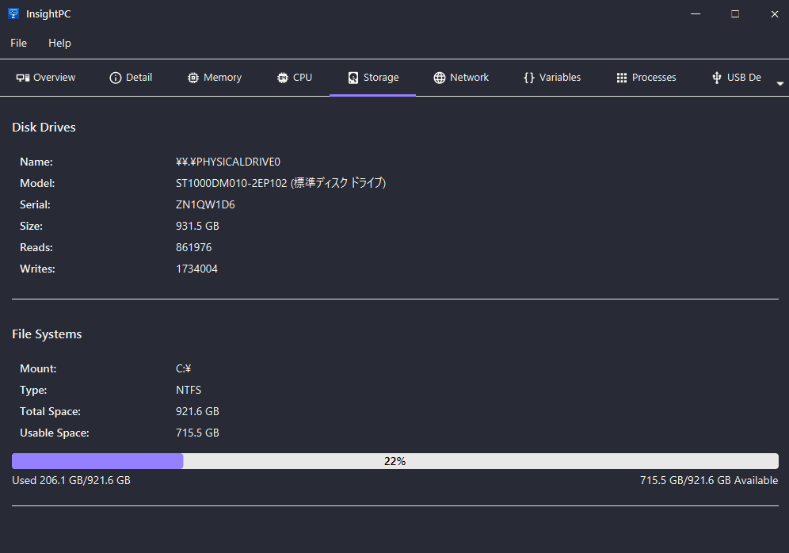
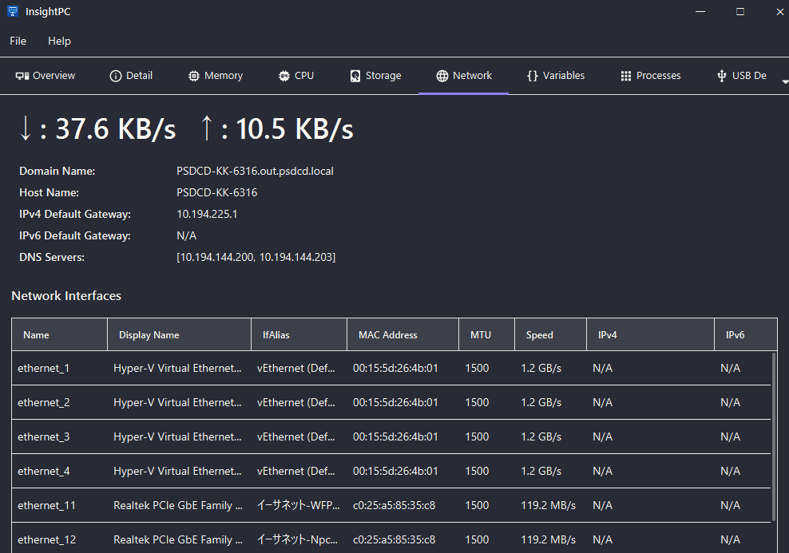
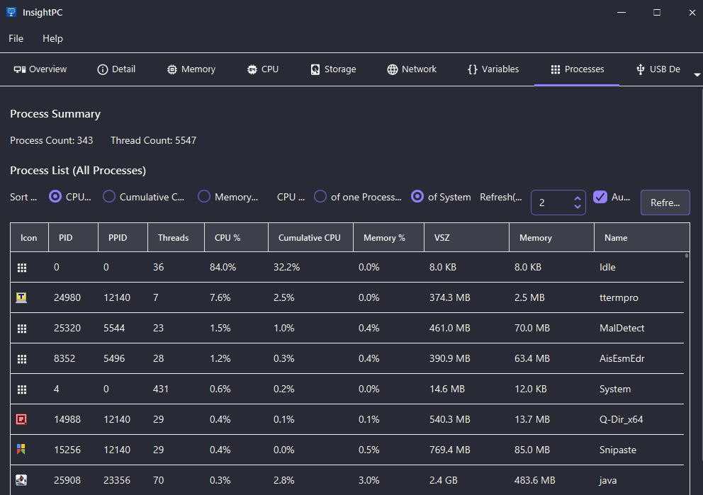
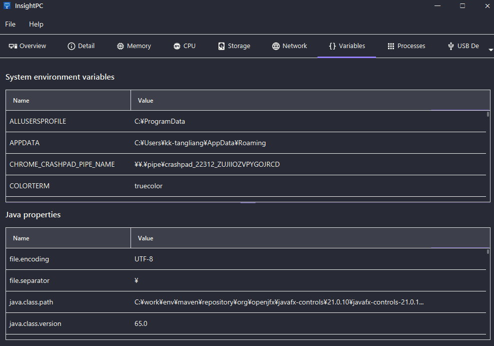
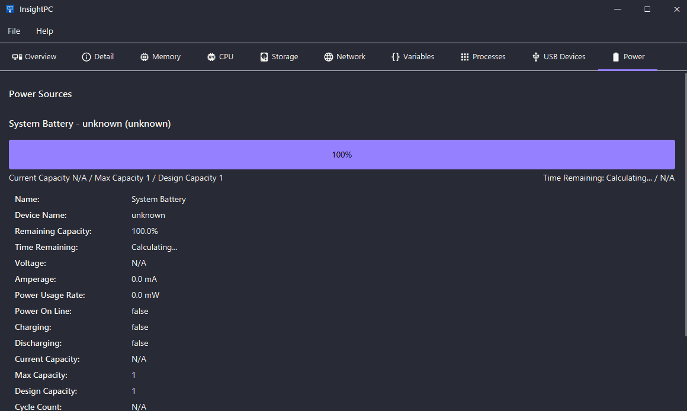
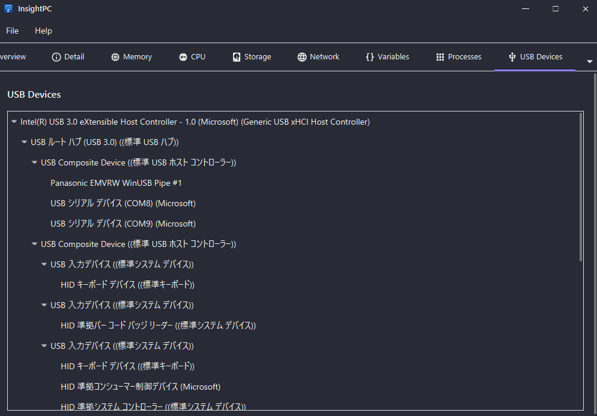
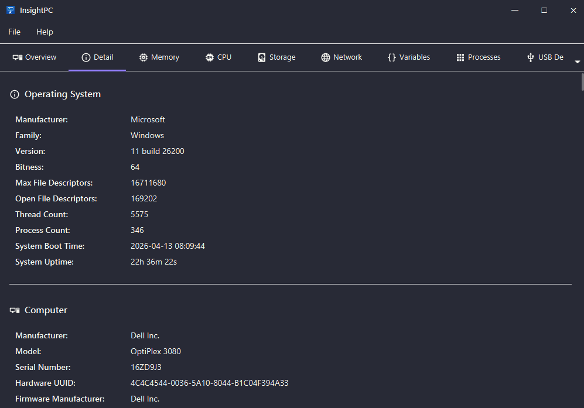

# InsightPC

A cross-platform system information visualizer built with JavaFX and OSHI.

## Features

- **System Overview**: Operating system, manufacturer, model, and uptime
- **CPU Information**: Processor details, core counts, frequency, and real-time usage monitoring
- **Memory Monitoring**: Physical memory, virtual memory, swap space, and memory stick details
- **Disk Information**: Disk drives, file systems, and storage usage
- **Network Interfaces**: Network adapters, MAC addresses, IP addresses, and traffic statistics
- **Process Management**: Running processes with PID, memory usage, and CPU consumption
- **Multi-language Support**: English, Chinese (Simplified), and Japanese
- **Theme Support**: AtlantaFX themes (Primer Light/Dark, Nord Light/Dark)
- **User Preferences**: Persistent settings for language and theme

## Download

- **Release**: <https://github.com/unknowIfGuestInDream/InsightPC/releases>
- **Jenkins**: <https://jenkins.tlcsdm.com/job/Tool/job/InsightPC>

## Screenshots

The screenshots below are from the application UI and are stored in `/readme`.

<p align="center">
  
  
</p>
<p align="center">
  
  
</p>
<p align="center">
  
  
</p>
<p align="center">
  
  
</p>
<p align="center">
  
  
</p>

## Requirements

- Java 21 or later
- Maven 3.9+

## Getting Started

### Build

```bash
mvn clean package
```

### Run

```bash
mvn javafx:run
```

### Test

```bash
mvn clean verify
```

## License

[MIT License](LICENSE)
